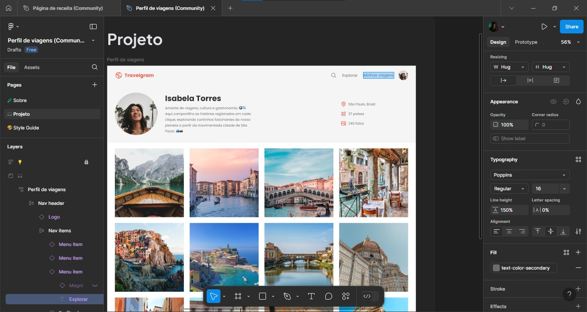

  

<strong>Projeto de Formação Fullstack</strong>.
Utilizando HTML e CSS e conceitos de flexbox.
<em>Fundamentos do HTML e CSS na Rocketseat</em>.

  <a href="#-tecnologias">Tecnologias</a>&nbsp;&nbsp;&nbsp;|&nbsp;&nbsp;&nbsp;
  <a href="#-projeto">Projeto</a>&nbsp;&nbsp;&nbsp;|&nbsp;&nbsp;&nbsp;
  <a href="#memo-licença">Licença</a>

  

 

  

## Desafio Rocketseat